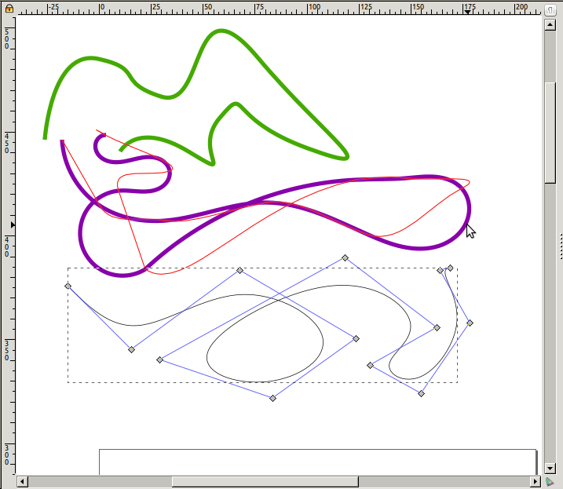
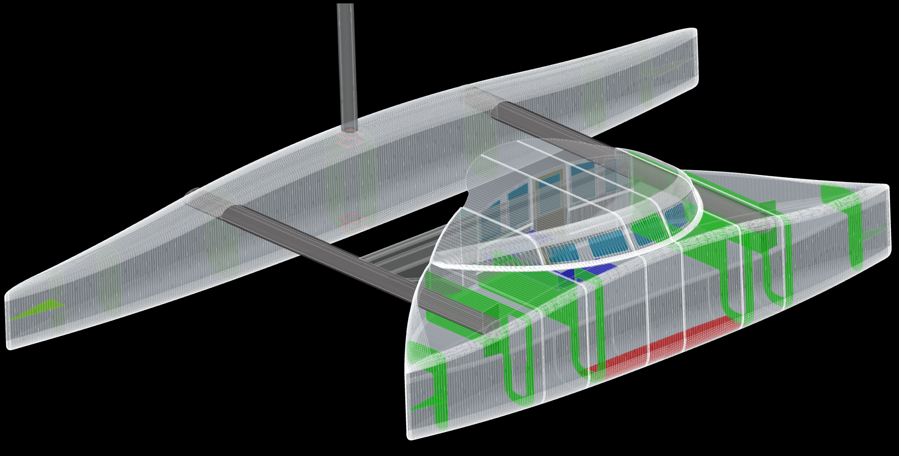
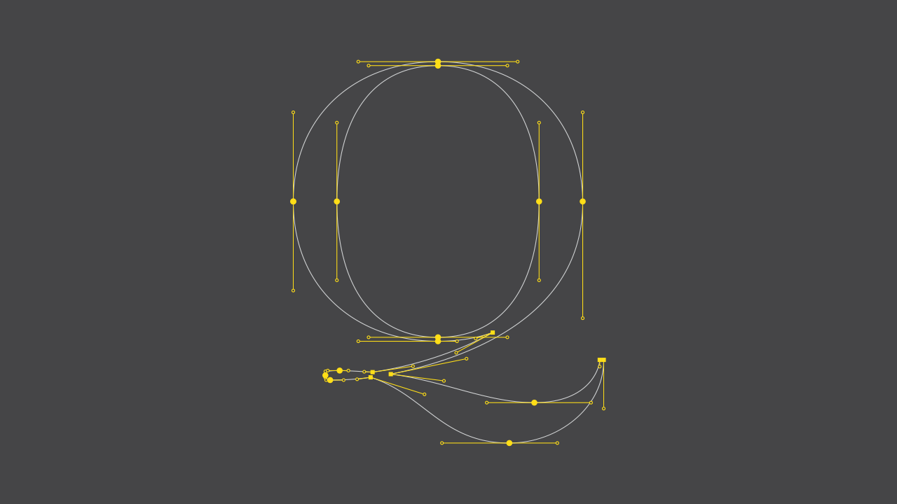
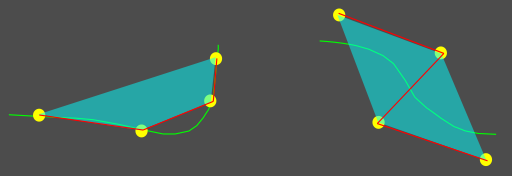
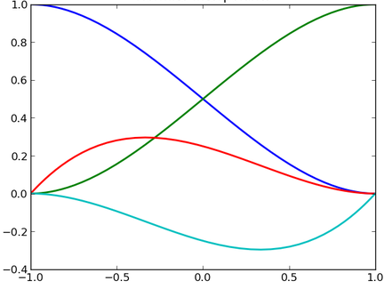
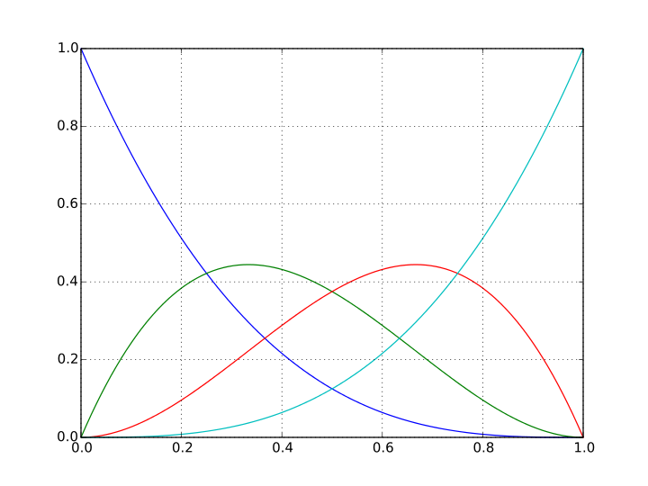

<section id="themes">
	<h2>Themes</h2>
		

			Set your presentation theme:  
			<!-- Hacks to swap themes after the page has loaded. Not flexible and only intended for the reveal.js demo deck. -->
                        <a href="#" onclick="document.getElementById('theme').setAttribute('href','css/theme/black.css'); return false;">Black (default)</a> -
			<a href="#" onclick="document.getElementById('theme').setAttribute('href','css/theme/white.css'); return false;">White</a> -
			<a href="#" onclick="document.getElementById('theme').setAttribute('href','css/theme/league.css'); return false;">League</a> -
			<a href="#" onclick="document.getElementById('theme').setAttribute('href','css/theme/sky.css'); return false;">Sky</a> -
			<a href="#" onclick="document.getElementById('theme').setAttribute('href','css/theme/beige.css'); return false;">Beige</a> -
			<a href="#" onclick="document.getElementById('theme').setAttribute('href','css/theme/simple.css'); return false;">Simple</a>  
			<a href="#" onclick="document.getElementById('theme').setAttribute('href','css/theme/serif.css'); return false;">Serif</a> -
			<a href="#" onclick="document.getElementById('theme').setAttribute('href','css/theme/blood.css'); return false;">Blood</a> -
			<a href="#" onclick="document.getElementById('theme').setAttribute('href','css/theme/night.css'); return false;">Night</a> -
			<a href="#" onclick="document.getElementById('theme').setAttribute('href','css/theme/moon.css'); return false;">Moon</a> -
			<a href="#" onclick="document.getElementById('theme').setAttribute('href','css/theme/solarized.css'); return false;">Solarized</a>
		

</section>

H:

# Curves

Jean Pierre Charalambos

H:

# Index

 1. Intro<!-- .element: class="fragment" data-fragment-index="1"-->
 2. Cubic natural splines<!-- .element: class="fragment" data-fragment-index="2"-->
 3. Cubic Hermit splines<!-- .element: class="fragment" data-fragment-index="3"-->
 4. Bézier curves<!-- .element: class="fragment" data-fragment-index="4"-->
 
H:

## Intro: idea

> Find the piecewise interpolation polynomial(s) of degree $n$ (`$P(u) = c_nu^{n} + c_{n-1}u^{n-1} + ... + c_1u + c_0u^{0}$`) that best approximate a given a set of _control points_

### Advantages

<li class="fragment"> Compact representation
<li class="fragment"> The curve can have up to $n-1$ slope changes
<li class="fragment"> Make use either of a _linear combination_ of a set of _basis functions_, or recursive (parametric) _linear interpolation_ (`$P(u) = (P_0(1-u) + P_1(u), 0 \leq u \leq 1$` gives the point in the line defined from $P_0$ to $P_1$)
<li class="fragment"> Affine transformations of the curve <-> transformation on the control points

V:

## Intro: use cases
### Drawing tool

<figure>
    
    <figcaption>Inkscape</figcaption>
</figure>

V:

## Intro: use cases
### Animation curves

<video controls data-autoplay loop src="vid/animation.ogv"></video>

V:

## Intro: use cases
### CAD

<figure>
    
    <figcaption>Surface model</figcaption>
</figure>

V:

## Intro: use cases
### Fonts

<figure>
    
    <figcaption>Font modelling</figcaption>
</figure>

V:

## Intro: General notions

1. Curve fits the interpolation<!-- .element: class="fragment" data-fragment-index="1"-->
2. Curve approximates the interpolation<!-- .element: class="fragment" data-fragment-index="2"-->
3. Convex hull<!-- .element: class="fragment" data-fragment-index="3"-->
4. Control polygon<!-- .element: class="fragment" data-fragment-index="4"-->

V:

## Intro: Problem statement

<li class="fragment"> One or several curve section -> piecewise spline
<li class="fragment"> For each piecewise section: $P(u) = ( x(u), y(u), z(u) )^{T}$ , $u_1 \leq u \leq u_2$
<li class="fragment"> $P'(u) = ( x'(u), y'(u), z'(u) )^{T} $ , $u_1 \leq u \leq u_2$ defines the tangent parametric vector of the curve

V:

## Intro: Continuity

### Geometric

$G^{0}$: if the sections extreme points meet at the same place<!-- .element: class="fragment" data-fragment-index="1"-->

$G^{1}$: if (besides $G^{0}$) the vector tangents directions (but no the magnitudes) are the same<!-- .element: class="fragment" data-fragment-index="2"-->

### Parametric

$C^{n}$: if $d^{n}/d u^{n}P(u)$, are the same for both sections<!-- .element: class="fragment" data-fragment-index="3"-->

### Observation

1. $C^{1} \rightarrow G^{1}$ but not the other way around<!-- .element: class="fragment" data-fragment-index="4"-->
1. If $n > m$ then $C^{n} \rightarrow C^{m}$<!-- .element: class="fragment" data-fragment-index="5"-->

H:

## Cubic natural splines: problem statement

$P(u)=(x(u),y(u),z(u))^{T}$, $u_1 \leq u \leq u_2$

For each spline section:

\\[x(u) = a_x u^{3} + b_x u^{2} + c_x u + d_x\\]
\\[y(u) = a_y u^{3} + b_y u^{2} + c_y u + d_y\\]
\\[z(u) = a_z u^{3} + b_z u^{2} + c_z u + d_z\\]

$0 \leq u \leq 1$

V:

## Cubic natural splines: problem statement

Which may be written vectorially as:

$P(u)=a u^{3} + b u^{2} + c u + d , 0 \leq u \leq 1$

hence

\\[P(u) = 
\begin{bmatrix}
	u^{3} & u^{2} & u & 1 \cr
\end{bmatrix}
	\bullet	\begin{bmatrix}
	a & b & c & d \cr
\end{bmatrix}^{T} = U \bullet C\\]
\\[ P'(u) = \begin{bmatrix}
	3u^{2} & 2u & 1 & 0 \cr
	\end{bmatrix}
	\bullet \begin{bmatrix}
	a & b & c & d \cr
	\end{bmatrix}
^{T} = U' \bullet C\\]
\\[ P''(u) = \begin{bmatrix}
	6u & 2 & 0 & 0 \cr
	\end{bmatrix}
	\bullet \begin{bmatrix}
	a & b & c & d \cr
	\end{bmatrix}
^{T} = U'' \bullet C\\]

$0 \leq u \leq 1$

We have $n+1$ control points: $P_k = (x_k,y_k,z_k),  k = 0,1,2,...,n$

V:

## Cubic natural splines: problem statement

Since there's $n+1$ control points then we have:

1. $n$ piecewise sections<!-- .element: class="fragment" data-fragment-index="1"-->
1. $4n$ polynomial coeficients (unknowns)<!-- .element: class="fragment" data-fragment-index="2"-->

V:

## Cubic natural splines: solution

Specification from $C^{2}$: Since there's $n+1$ control points then it follows:

1. For each $n-1$ intermediate control points we have $4$ equations ($4n-4$ equations in total):<!-- .element: class="fragment" data-fragment-index="1"-->
  * Positions (2 equations)
  * 1st and 2nd derivatives (2 equations)
2. For the 2 extreme control points we have $2$ equations ($4$ in total):<!-- .element: class="fragment" data-fragment-index="2"-->
  * Positions (2 equations)
  * The second derivatives should be 0 (2 equations)
  
Details [here](http://mathworld.wolfram.com/CubicSpline.html)

H:

## Cubic Hermit splines

    
    <ul style="width: 30%;">
        $P(u)=a u^{3} + b u^{2} + c u + d$
        $P'(u)=3a u^{2} + 2b u + c + 0$
        $0 \leq u \leq 1$
    </ul>

We get the following equations:<!-- .element: class="fragment" data-fragment-index="1"-->
1. $p_k = P(0) = d$<!-- .element: class="fragment" data-fragment-index="2"-->
1. $p_{k+1} = P(1) = a+b+c+d$<!-- .element: class="fragment" data-fragment-index="3"-->
1. $Dp_k = P'(0) = c$<!-- .element: class="fragment" data-fragment-index="4"-->
1. $Dp_{k+1}= P'(1) = 3a + 2b + c$<!-- .element: class="fragment" data-fragment-index="5"-->

V:

## Cubic Hermit splines

1. $p_k = P(0) = d$
1. $p_{k+1} = P(1) = a+b+c+d$
1. $Dp_k = P'(0) = c$
1. $Dp_{k+1}= P'(1) = 3a + 2b + c$

which may be written as:

`$\begin{bmatrix} p_k \cr p_{k+1} \cr
 Dp_k \cr Dp_{k+1} \cr \end{bmatrix} = \begin{bmatrix}
	0 & 0 & 0 & 1 \cr
 1 & 1 & 1 & 1 \cr
 0 & 0 & 1 & 0 \cr 4 & 2 & 1 & 0 \cr
 \end{bmatrix}
 \begin{bmatrix} 
	a \cr 
	b \cr
	c \cr
	d \cr
	\end{bmatrix}
$`
<!-- .element: class="fragment" data-fragment-index="1"-->

V:

## Cubic Hermit splines

Solving for $C$, we get:

`$\begin{bmatrix} 
a \cr 
b \cr
 c \cr
 d \cr
 \end{bmatrix}
 = 
\begin{bmatrix}
 2 & -2 & 1 & 1 \cr
 -3 & 3 & -2 & -1 \cr
 0 & 0 & 1 & 0 \cr
 1 & 0 & 0 & 0 \cr
 \end{bmatrix} \bullet \begin{bmatrix} 
 p_k \cr 
 p_{k+1} \cr
 Dp_k \cr
 Dp_{k+1} \cr
 \end{bmatrix}
 $`

V:

## Cubic Hermit splines
### Matrix form

<table>
<tr>
	<td>
\\[M_H =
\begin{bmatrix}
 2 & -2 & 1 & 1 \cr
 -3 & 3 & -2 & -1 \cr
	0 & 0 & 1 & 0 \cr
 1 & 0 & 0 & 0 \cr
 \end{bmatrix}\\]
	</td>
</tr>
</table>

`$P(u) = p_k(2u^{3}-3u^{2}+1)+p_{k+1}(-2u^{3}+3u^{2})$`
        `$+ Dp_k(u^{3}-2u^{2}+u)+Dp_{k+1}(u^{3}-u^{2})$`

V:

## Cubic Hermit splines: Basis functions

`$P(u) = p_k(2u^{3}-3u^{2}+1)+p_{k+1}(-2u^{3}+3u^{2})$`
        `$+ Dp_k(u^{3}-2u^{2}+u)+Dp_{k+1}(u^{3}-u^{2})$`

`$P(u) = p_k H_0(u)+p_{k+1} H_1(u)+Dp_k H_2(u)+Dp_{k+1} H_3(u)$`
<!-- .element: class="fragment" data-fragment-index="1"-->

The polynomials $H_i(u)$, for $i= 0,1,2,3$, are the Hermite basis functions:
<!-- .element: class="fragment" data-fragment-index="2"-->

<figure>
    
    <figcaption>$H_0(u)$ (red), $H_1(u)$ (blue), $H_2(u)$ (green), and $H_3(u)$ (cyan)</figcaption>
</figure>
<!-- .element: class="fragment" data-fragment-index="3"-->

V:

## Cubic Hermit splines: examples and continuity

<table>
<tr>
	<td>
Curve family
	</td>
	<td colspan=3>
Continuty between curves
	</td>
</tr>
<tr>
	<td>

	</td>
	<td>
Curve 1
$
\begin{bmatrix} P(0) \cr P(1) \cr
 P'(0) \cr P'(1)\cr
 \end{bmatrix}$

	</td>
	<td>
Curve 2
$\begin{bmatrix} P(1) \cr P(2) \cr k P'(1) \cr
 P'(2)\cr
\end{bmatrix}$
	</td>
	<td>
Si $k > 0 \rightarrow G^{1}$ 
Si $k = 1 \rightarrow C^{1}$
	</td>
</tr>
</table>

V:

## Cubic Hermit splines: Cardinal splines

if within a Hermite spline we choose $P(0)$, $P(1)$, $P'(0)$ and $P'(1)$ to be:

1. $P(0)=P_k$
1. $P(1)=P_{k+1}$
1. $P'(0)=1/2(1-t)P_{k+1}-P_k-1$ 
1. $P'(1)=1/2(1-t)P_{k+2}-P_k$

where $t$ $\in([0,1]$ is the _tension_ parameter, we get a _Cardinal_ spline

For $t=0$ we get the [Catmull-Rom spline](https://en.wikipedia.org/wiki/Cubic_Hermite_spline#Catmull.E2.80.93Rom_spline)

V:

## Cubic Hermit splines: Cardinal splines

`$P(u)=\begin{bmatrix} u^{3} & u^{2} & u & 1\end{bmatrix} \bullet M_C \bullet \begin{bmatrix} P_{k-1} \cr P_k \cr P_{k+1} \cr P_{k+2} \end{bmatrix}$`

$
M_c =\begin{bmatrix} 
-s & 2-s & s-2 & s\cr
2s & s-3 & 3-2s & -s \cr
-s & 0 & s & 0\cr
0 & 1 & 0 & 0 \cr
\end{bmatrix}$

where $s=(1-t)/2$

V:

## Cubic Hermit splines: Cardinal splines

`$P(u)=p_{k-1}(-su^{3}+2su^{2}-su)+p_k[(2-s)u^{3}+(s-3)u^{2}+1]$`
`$+p_{k+1}[(s-2)u^{3}+(3-2)u^{2}+su]+p_{k+2}(su^{3}-su^{2})$`

`$=p_{k-1} CAR_0(u)+p_k CAR_1(u)+p_{k+1} CAR_2(u)+ p_{k+2} CAR_3(u)$`

The polynomials $CAR_k(u)$, for $i= 0,1,2,3$, are the Cardinal basis functions

H:

## Bézier curves: De Casteljau algorithm

<section>
	<iframe width="420" height="345" src="http://www.youtube.com/embed/YATikPP2q70"></iframe>
</section>

V:

## Bézier curves: overview

<section>
	<iframe width="420" height="345" src="http://www.youtube.com/embed/2HvH9cmHbG4"></iframe>
</section>

V:

## Bézier curves: definition

$P(u)=(x(u),y(u),z(u))^{T}, 0 \leq u \leq 1$

We have $n+1$ control points: $P_k=(x_k,y_k,z_k), k=0,1,2,....,n$

`$P(u)= \sum P_k BEZ_{k,n}(u), k=0,1,2,...,n$`

<li class="fragment"> `$P(u)= \sum x_k BEZ_{k,n}(u), k=0,1,2,...,n$`
<li class="fragment"> `$P(u)= \sum y_k BEZ_{k,n}(u), k=0,1,2,...,n$`
<li class="fragment"> `$P(u)= \sum z_k BEZ_{k,n}(u), k=0,1,2,...,n$`

V:

## Bézier curves: Bernstein polynomials

`$BEZ_{k,n}(u)=C(n,k)u^{k}(1-u)^{n-k}$`

`$BEZ_{k,n}(u)=(1-u)BEZ_{k,n-1}(u)+u BEZ_{k-1,n-1}(u), n > k \ge 1$`<!-- .element: class="fragment" data-fragment-index="1"-->

`$BEZ_{k,k}(u)=u^{k}$`<!-- .element: class="fragment" data-fragment-index="2"-->

`$BEZ_{0,k}(u)=(1-u)^{k}$`<!-- .element: class="fragment" data-fragment-index="3"-->

`$C(n,k)=n!/(k!(n-k)!)$`<!-- .element: class="fragment" data-fragment-index="4"-->

`$C(n,k)=C(n,k-1)(n-k+1)/k,n>k$`<!-- .element: class="fragment" data-fragment-index="5"-->

V:

## Bézier curves: Properties

1. A Bézier curve can be split into two Bézier curves<!-- .element: class="fragment" data-fragment-index="1"-->
2. A Bézier curve is a polynomial of degree $n$ (one less than the total number of control points)<!-- .element: class="fragment" data-fragment-index="2"-->
3. The curve interpolates the first and last control points<!-- .element: class="fragment" data-fragment-index="3"-->
    1. $P(0)=p_0$
    2. $P(1)=p_n$
4. The start and end of the curve is tangental to the start and end section of the control polygon<!-- .element: class="fragment" data-fragment-index="4"-->
    1. `$P'(0)=-n p_0 +n p_1$`
    2. `$P'(1)=-n p_{n-1} + n p_n$`
5. The curve lies within the (control points) convex hull<!-- .element: class="fragment" data-fragment-index="5"-->
    * `$\sum BEZ_{k,n}(u)=1, k=0,1,2,...,n$`
        
V:

## Bézier curves: Design techniques

Joining Bézier segments

> Property 3: The start and end of the curve is tangental to the start and end section of the control polygon

Example for $(G^{0}, G^{1} and) C^{1}$ continuity

<!-- .element: class="fragment" data-fragment-index="1"-->

V:

## Bézier curves: Cubic splines
### Basis functions

Let $n=3$ ($4$ control points): $P_k=(x_k,y_k,z_k), k=0,1,2,3$, we get:

1. `$BEZ_{0,3}(u)=(1-u)^{3}$`
2. `$BEZ_{1,3}(u)=3u(1-u)^{2}$`
3. `$BEZ_{2,3}(u)=3u^{2}(1-u)$`
4. `$BEZ_{3,3}(u)=u^{3}$`

`$P(u) = p_0 BEZ_{0,3}(u) + p_1 BEZ_{1,3}(u) + p_2 BEZ_{2,3}(u) + p_3 BEZ_{3,3}(u)$`
<!-- .element: class="fragment" data-fragment-index="1"-->

V:

## Bézier curves: Cubic splines
### Basis functions

The polynomials $BEZ_{i,3}(u)$, for $i= 0,1,2,3$, are the Bezier basis functions:
<!-- .element: class="fragment" data-fragment-index="2"-->

<figure>
    
    <figcaption>`$BEZ_{0,3}(u)$` (blue), `$BEZ_{1,3}(u)$` (green), `$BEZ_{2,3}(u)$` (red) and `$BEZ_{3,3}(u)$` (cyan)</figcaption>
</figure>
<!-- .element: class="fragment" data-fragment-index="3"-->

V:

## Bézier curves: Cubic splines
### Matrix form

... which is the same as:

`$P(u)=\begin{bmatrix}u^{3} & u^{2} & u & 1 \end{bmatrix}
 \bullet M_{Bez} \bullet \begin{bmatrix}
 p_0 \cr p_1 \cr p_2 \cr
 p_3 \cr \end{bmatrix}
$`

`$M_{Bez} =\begin{bmatrix}
 -1 & 3 & -3 & 1 \cr
 3 & -6 & 3 & 0 \cr -3 & 3 & 0 & 0 \cr
 1 & 0 & 0 & 0 \cr
 \end{bmatrix}
$`

H:

## References

1. [Mathematics of Computer Graphics and Virtual Environments](https://www.youtube.com/channel/UCfO67kOKUqVlos7IUANDPHw)
2. [Pyramid Algorithms, Goldman](https://www.elsevier.com/books/pyramid-algorithms/goldman/978-1-55860-354-7)
